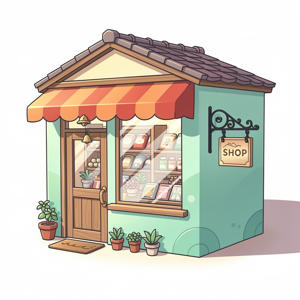
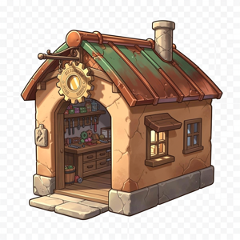
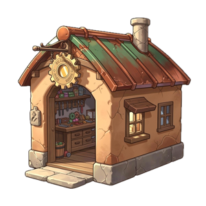
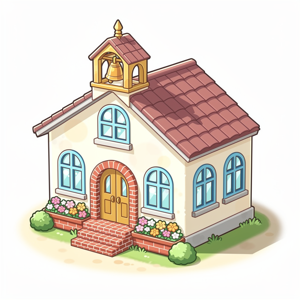
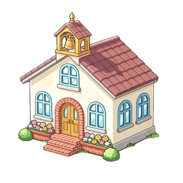

# apple-remove-bg

Remove image backgrounds using Apple's native Vision framework. **Offline, zero API cost, instant.**

Uses `VNGenerateForegroundInstanceMaskRequest` — the same subject-detection engine behind the "Lift Subject" feature in Photos, Safari, and iMessage.

## Requirements

- macOS 14.0 (Sonoma) or later
- Any Mac with Neural Engine (Apple Silicon, or Intel Macs 2018+)

## Install

```bash
# Download the binary
curl -L -o remove-bg https://github.com/Muzileess290/apple-remove-bg/releases/latest/download/remove-bg
chmod +x remove-bg
```

Or clone and compile from source:

```bash
git clone https://github.com/Muzileess290/apple-remove-bg.git
cd apple-remove-bg
swiftc remove-bg.swift -o remove-bg
```

## Usage

```bash
./remove-bg input.png output.png
```

```bash
# Batch processing
for f in *.png; do
  ./remove-bg "$f" "nobg/${f%.png}_nobg.png"
done
```

## Before / After

AI-generated game assets, backgrounds removed with a single command:

| Type | Before | After |
|------|--------|-------|
| House |  |  |
| Shop |  |  |
| Workshop |  |  |
| School |  |  |

*AI-generated MapleStory-style building sprites, backgrounds removed with a single `./remove-bg` command each.*

## How it works

```
Input PNG
  ↓ AppKit (NSImage → CGImage)
  ↓ VNGenerateForegroundInstanceMaskRequest
  ↓ CVPixelBuffer mask
  ↓ CIBlendWithMask + transparent background
  ↓ NSBitmapImageRep → PNG
Output PNG (RGBA, transparent background)
```

All of it runs on-device using system frameworks: Vision, CoreImage, AppKit. No network calls, no third-party libraries, no API keys.

## What works best

| Great                          | Not great                       |
|--------------------------------|---------------------------------|
| Objects, products, items       | Flat landscapes without subject |
| People, animals, characters    | Abstract textures               |
| Buildings, vehicles, furniture | Top-down terrain/scenes         |
| Clear foreground subjects      | Heavily blended foregrounds     |

## Use as a Claude Code skill

Place in `~/.claude/skills/apple-remove-bg/`:

```
~/.claude/skills/apple-remove-bg/
├── SKILL.md
├── remove-bg          # compiled binary
└── remove-bg.swift    # source (optional)
```

Then invoke via Claude Code:

```
Use apple-remove-bg skill to remove background from photo.png
```

## License

MIT
